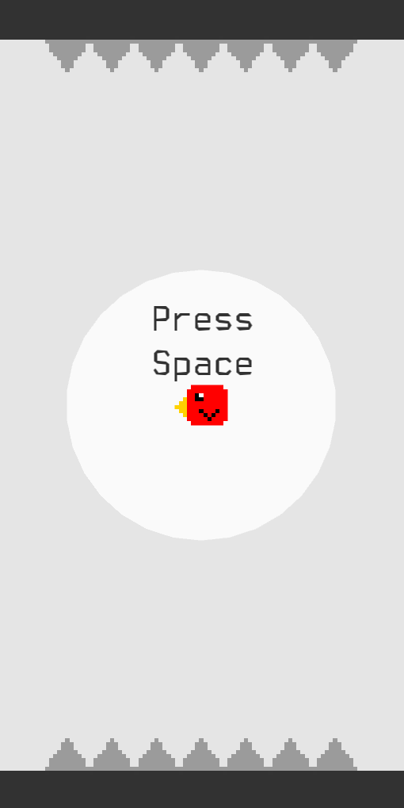

# SDC - Simple Don't touch the spikes Clone

  

## Build Dependencies

Alpine Linux:

- `sfml`
- `sfml-dev`
- `csfml`
- `csfml-dev`

Void Linux:

- `SFML`
- `SFML-devel`
- `CSFML`
- `CSFML-devel`

Arch Linux:

- `sfml`
- `csfml`

## Building

	meson build
	ninja -C build

## Running

	./build/sdc

Note: Proper hit-boxes aren't implemented yet. Contributions are welcome.
